# Architecture — Semi-Autonomous Agent Loop

The factory as the 7-stage loop: **Discover → Prioritize → Develop → Deploy → Distribute → Measure → Iterate.** Products are factory **outputs** between Deploy and Distribute, and they sit on the loop spine.

**Legend.**
- **Status tags:** `AUTO` (no human), `SEMI` (scripted, human-triggered), `MANUAL`, `PARTIAL` (some surfaces auto, some not).
- **Edge styles:** solid arrow = mutates state. Dotted arrow = reads / observes / gates / orchestration hook.
- **OKR fields:** `Result` = qualitative outcome (Not Started · Started · Not Achieved · Partially Achieved · Achieved). `Score` = numeric 0.0–1.0 produced by `measure-kr*.sh`. `Cycle` = 7-day Monday-start iteration shared across strategy and work projects.
- **Pipeline-health gates:** `L1` = cycle-close artifacts present (blocks ideation/picking until prior cycle wraps). `L2` = field-constraint enforcement (Priority/Effort/Work/AC consistency).
- **Three-track scoring (Iterate):** two outcome tracks + a governance lane — Track A (measurement readiness), Track B (market evidence), Governance (Cycle Close Protocol — pass/fail, not a score).

```mermaid
%%{init: {"flowchart": {"curve": "basis"}}}%%
flowchart LR
  classDef stage fill:#e8f0fe,stroke:#1a73e8,stroke-width:2px,color:#000,text-align:left
  classDef strategy fill:#fff4e5,stroke:#e8710a,stroke-width:2px,color:#000,text-align:left
  classDef product fill:#e6f4ea,stroke:#188038,stroke-width:2px,color:#000,text-align:left
  classDef orch fill:#f3e8fd,stroke:#8430ce,stroke-width:2px,color:#000,text-align:left
  classDef partial fill:#fce8e6,stroke:#d93025,stroke-width:2px,color:#000,text-align:left

  S["<b>STRATEGY</b> · Goals project (<okr-project>)<br/>Objectives → Key Results<br/>fields: Status (effort) · Result (qualitative outcome) · Score (0.0–1.0 numeric) · Cycle (7-day iter)<br/>each KR is typed at creation: <b>Track A</b> (instrument-readiness KR) or <b>Track B</b> (market-evidence KR)<br/>track determines which D7 lane consumes the Score · KR body carries measurement criteria read by D6"]:::strategy

  D1["<b>1 · DISCOVER</b>  [AUTO ideate · MANUAL signals]<br/>━━━━━━━━━━━━━━━━━━━<br/>signals: analytics errors · user feedback ·<br/>support · weekly review · web research<br/><br/>ideate-issues.sh — dual-agent:<br/>① ideate 3–4 issues per active KR (unbiased)<br/>② classify match / partial / novel → link or create"]:::stage

  D2["<b>2 · PRIORITIZE</b>  [AUTO work · MANUAL OKRs]<br/>━━━━━━━━━━━━━━━━━━━<br/>Solo project work issues<br/>Status · Priority · Effort · Work · Cycle<br/><br/>pipeline-health.sh — failure behavior:<br/>• L1 — cycle-close artifacts present → <b>hard-blocks</b> ideate-issues.sh and pick-next-issue.sh until prior cycle wraps<br/>• L2 — field-constraint enforcement → <b>auto-fix</b> safe violations (Todo→Backlog if prereqs unchecked, all-closed→Done); <b>warn</b> on the rest<br/>pick-next-issue.sh — OKR→KR→issue traversal · returns next #"]:::stage

  subgraph D3["<b>3 · DEVELOP</b>  [AUTO]  autonomous workflow — per-issue worktree + dev container · resumable · each phase delegates to a specialist agent"]
    direction LR
    D3_SETUP["Setup<br/>worktree<br/>dev container<br/>port-isolated"]:::stage
    D3_PLAN["Plan<br/>workflow-<br/>planner"]:::stage
    D3_EXEC["Execute<br/>Claude Code<br/>→ PR"]:::stage
    D3_REV["Review<br/>harsh-pr-<br/>reviewer +<br/>/code-review"]:::stage
    D3_FIX["Fix<br/>fix-<br/>triager"]:::stage
    D3_VFY["Verify<br/>visual-<br/>verifier<br/>(if needs-visual-<br/>verification label)"]:::stage
    D3_PREM["Pre-Merge<br/>rebase ·<br/>hooks · AC<br/>verify (15min<br/>timeout)"]:::stage
    D3_SETUP --> D3_PLAN --> D3_EXEC --> D3_REV --> D3_FIX --> D3_VFY --> D3_PREM
  end

  D4["<b>4 · DEPLOY</b>  [AUTO preview · MANUAL prebuilt prod · AUTO post-merge AC]<br/>━━━━━━━━━━━━━━━━━━━<br/>Merge (squash) → main · Status → Post-Merge<br/>Preview auto on PR · prod = manual prebuilt deploy<br/>nightly.yml runs Claude agent per Post-Merge issue →<br/>verifies post-merge ACs → Done or reopens to Todo"]:::stage

  PRD["<b>FACTORY OUTPUTS</b> — deployed product surfaces (on the loop spine)<br/>single web app · hostname-routed via middleware<br/>━━━━━━━━━━━━━━━━━━━<br/>• &lt;factory-product-A&gt; (AI chat) — AI image · guest list · payments · ZIP<br/>• &lt;factory-product-B&gt; (overlay) — generic bulk personalization · no AI<br/>• &lt;factory-portfolio&gt; + subdomains — hub + 1-week validation surfaces"]:::product

  D5["<b>5 · DISTRIBUTE</b>  [SEMI]<br/>━━━━━━━━━━━━━━━━━━━<br/>per distribution plan · primary product first<br/><br/>Organic posting via playwright-cli<br/>Pinterest · TikTok · Instagram · X · Reddit (days 2–4)<br/>Ad smoke test — paid fallback if organic underperforms (days 4–6)"]:::stage

  D6["<b>6 · MEASURE</b>  [PARTIAL — scripts shipped, auto signal-detection missing]<br/>━━━━━━━━━━━━━━━━━━━<br/>measure-kr*.sh per KR · measure-lib.sh<br/>ANALYTICS_OWNER_FILTER · snapshot_exists_today() idempotency<br/>data: analytics · payments · GitHub · Playwright · email · Postgres<br/>output: score X.X (band) + optional --snapshot comment on KR<br/><br/>missing: auto-route measured deltas (errors · drops · spikes) back to Discover as new issues<br/><br/>kill/continue gate (day 7): traffic + engagement thresholds decide kill vs continue"]:::partial

  D7["<b>7 · ITERATE</b>  [MANUAL — founder runs weekly review issue in goals repo]<br/>━━━━━━━━━━━━━━━━━━━<br/>two outcome tracks + governance:<br/>• Track A — <i>measurement readiness</i>: consumes Scores from KRs typed Track A (instrument is live: UTM deployed, query built)<br/>• Track B — <i>market evidence</i>: consumes Scores from KRs typed Track B (customer signal: using · returning · asking · paying)<br/>• Governance — Cycle Close Protocol (pass/fail, not a score): per-product signals + verdict + triggers<br/><br/>day-7 kill verdict execution path: founder reads D6 verdict during weekly review →<br/>writes per-product continue/pivot/kill into Cycle Close Protocol comment →<br/>updates Goals project Objective Status / Result · removes killed KRs from next-cycle iteration<br/><br/>Cycle N+1 design — concentration target · new Objectives/KRs (each KR explicitly typed Track A or B at creation)"]:::stage

  ORCH["<b>ORCHESTRATION</b> — keeps the loop turning unattended<br/>━━━━━━━━━━━━━━━━━━━<br/>terminal orchestration tool — workspace per Objective · tab per KR/issue · snapshot+restore Claude sessions<br/>host cron + nightly.yml — both fire at 03:00 UTC nightly<br/>cron kickstarts pick-next-issue.sh --exec · nightly.yml runs full-suite safety net + post-merge AC verifier (parallel Claude)"]:::orch

  %% =========== LOOP SPINE ===========
  S -->|active KRs| D1
  S -.->|KRs read by traversal| D2
  D1 -->|create / link| D2
  D2 -->|next issue #| D3_SETUP
  D3_PREM -->|merged PR| D4
  D4 -->|ships into| PRD
  PRD -->|drive traffic to| D5
  D5 -->|reach · engagement · behavior · payments| D6
  D6 -->|per-KR Score → Track A/B · day-7 kill verdict → Governance| D7
  D7 -->|Score · Result · new OKRs| S

  %% =========== ORCHESTRATION HOOKS ===========
  ORCH -. nightly kickstart .-> D2
  ORCH -. parallel runs · session resume .-> D3
  ORCH -. post-merge AC verifier · gates Done transition .-> D4
```

## Source-of-truth pointers

| Concern | File |
|---|---|
| Cycle cadence, scoring, wrap procedure | `docs/OKR_CYCLES.md` (private repo) |
| Workflow scripts contract | private repo (workflow CLAUDE.md) |
| Measurement conventions | private repo (measure CLAUDE.md) |
| Terminal orchestration | private repo (orchestrator CLAUDE.md) |
| Issue conventions | `docs/ISSUE_CONVENTIONS.md` (this repo) |
| OKR exemplars | `docs/OKR_EXEMPLARS.md` (this repo) |
